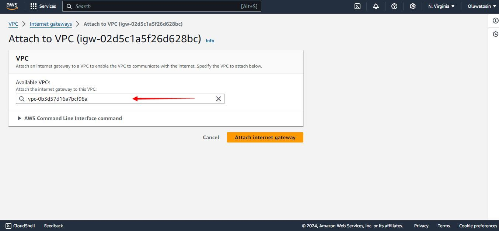
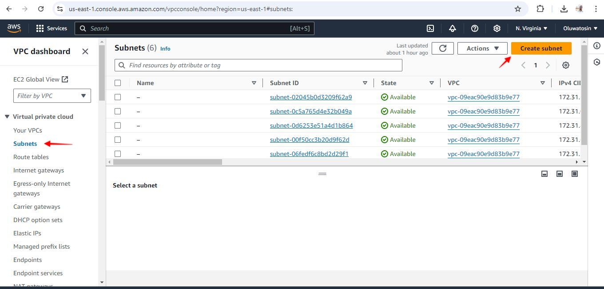
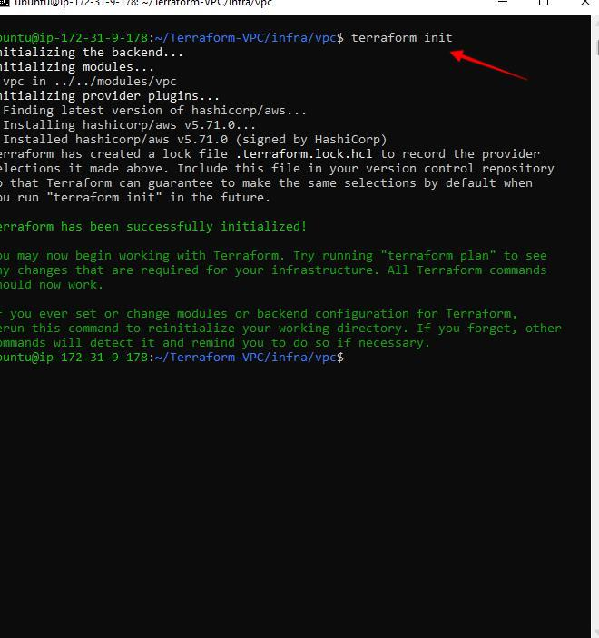

<h1>AWS VPC Project (Project 7)</h1>

 &#x2022; A Virtual Private Cloud (VPC) is a private, isolated section of a public cloud where users can launch and manage resources like virtual machines, databases, and storage, while keeping them logically separate from other users of the same cloud. A VPC combines the scalability and flexibility of public cloud infrastructure with the security and control features of private networks.

 ###  To create a VPC for this project and assign attach an internet gateway to it below are steps done.

 &#x2022; I Logged into my AWS management console and search VPC

 

 &#x2022; Now I created an Internet Gateway

<table>
  <tr>
    <th>Subnet Name</th>
    <th>Availability Zone</th>
    <th>CIDR Block</th>
    <th>Type</th>
  </tr>
  <tr>
    <td>Prod-Web-Public-2a</td>
    <td>us-west-2a</td>
    <td>10.0.0.0/28</td>
    <td>Public</td>
  </tr>
  <tr>
    <td>Prod-Web-Public-2b</td>
    <td>us-west-2a</td>
    <td>10.0.0.16/28</td>
    <td>Public</td>
  </tr>
  <tr>
    <td>Prod-Web-Public-2c</td>
    <td>us-west-2c</td>
    <td>10.0.0.32/28</td>
    <td>Public</td>
  </tr>
</table>

 &#x2022; Using the above information data, we will create the public subnet

### Following the steps used to create the above, I created for other subnets
 &#x2022; Application Subnets
   
<table>
  <tr>
    <th>Subnet Name</th>
    <th>Availability Zone</th>
    <th>CIDR Block</th>
    <th>Type</th>
  </tr>
  <tr>
    <td>Prod-App-Private-2a</td>
    <td>us-west-2a</td>
    <td>10.0.0.48/28</td>
    <td>Private</td>
  </tr>
  <tr>
    <td>Prod-App-Private-2b</td>
    <td>us-west-2b</td>
    <td>10.0.0.64/28</td>
    <td>Private</td>
  </tr>
  <tr>
    <td>Prod-App-Private-2c</td>
    <td>us-west-2c</td>
    <td>10.0.0.80/28</td>
    <td>Private</td>
  </tr>
</table>

 &#x2022; Database Subnets 
  
 <table>
  <tr>
    <th>Subnet Name</th>
    <th>Availability Zone</th>
    <th>CIDR Block</th>
    <th>Type</th>
  </tr>
  <tr>
    <td>Prod-DB-Private-2a</td>
    <td>us-west-2a</td>
    <td>10.0.0.96/28</td>
    <td>Private</td>
  </tr>
  <tr>
    <td>Prod-DB-Private-2b</td>
    <td>us-west-2b</td>
    <td>10.0.0.112/28</td>
    <td>Private</td>
  </tr>
  <tr>
    <td>Prod-DB-Private-2c</td>
    <td>us-west-2c</td>
    <td>10.0.0.128/28</td>
    <td>Private</td>
  </tr>
</table>

&#x2022;Management Subnets
 
 <table>
  <tr>
    <th>Subnet Name</th>
    <th>Availability Zone</th>
    <th>CIDR Block</th>
    <th>Type</th>
  </tr>
  <tr>
    <td>Prod-Mgmt-Private-2a</td>
    <td>us-west-2a</td>
    <td>10.0.0.144/28</td>
    <td>Private</td>
  </tr>
  <tr>
    <td>Prod-Mgmt-Private-2b</td>
    <td>us-west-2b</td>
    <td>10.0.0.160/28</td>
    <td>Private</td>
  </tr>
  <tr>
    <td>Prod-Mgmt-Private-2c</td>
    <td>us-west-2c</td>
    <td>10.0.0.176/28</td>
    <td>Private</td>
  </tr>
</table>

&#x2022; Platform Subnets
 
 <table>
  <tr>
    <th>Subnet Name</th>
    <th>Availability Zone</th>
    <th>CIDR Block</th>
    <th>Type</th>
  </tr>
  <tr>
    <td>Prod-Platform-Private-2a</td>
    <td>us-west-2a</td>
    <td>10.0.0.192/28</td>
    <td>Private</td>
  </tr>
  <tr>
    <td>Prod-Platform-Private-2b</td>
    <td>us-west-2b</td>
    <td>10.0.0.208/28</td>
    <td>Private</td>
  </tr>
  <tr>
    <td>Prod-Platform-Private-2c</td>
    <td>us-west-2c</td>
    <td>10.0.0.224/28</td>
    <td>Private</td>
  </tr>
</table>

#### The result id below

## To Route Table Design

For each subnet group, I will created a custom route table and assign rules required for the specific subnets.

For example, all three public subnets will share the same public-subnet route table.

<table>
  <tr>
    <th>Subnet Destination</th>
    <th>CIDR</th>
    <th>Target</th>
  </tr>
  <tr>
    <td>Public</td>
    <td>0.0.0.0/0</td>
    <td>Internet Gateway</td>
  </tr>
  <tr>
    <td>App</td>
    <td>0.0.0.0/0</td>
    <td>Nat Gateway</td>
    <td>Private</td>
  </tr>
  <tr>
    <td>DB</td>
    <td>0.0.0.0/0</td>
    <td>Nat Gateway</td>
    <td>Private</td>
  </tr>
  <tr>
    <td>Management</td>
    <td>0.0.0.0/0</td>
    <td>Nat Gateway</td>
    <td>Private</td>
  </tr>
  <tr>
    <td>Platform</td>
    <td>0.0.0.0/0</td>
    <td>Nat Gateway</td>
    <td>Private</td>
  </tr>
</table>

&#x2022;   creating public route table

### I used the table and steps above create the other route tables and their subnet association

### NAT Gateway
A NAT gateway is a Network Address Translation (NAT) service. You can use a NAT gateway so that instances in a private subnet can connect to services outside your VPC but external services cannot initiate a connection with those instances.

&#x2022; We need to create a NAT gateway and attach it to all our route tables created earlier

&#x2022; select a subnet and allocate an elastic ip

### AWS VPC Topology
&#x2022; The following diagram shows the high-level VPC topology for our design. 
Note: Both the internet Gateway (IGW) and NAT gateway(NAT-GW) gets deployed in the public subnet.
To check our VPC topology:

### Network ACLs
Network access control list (NACL) is the native VPC functionality to control the inbound and outbound traffic at the subnet level.

In our architecture, the connection to the DB subnet should be allowed only from the App subnet and management subnet. The public subnet should not have direct access to the DB subnet.

The following are the tables for inbound and outbound rules for the DB NACL.

&#x2022;DB NACL (Inbound Rules)
 

<table>
  <tr>
    <th>Rule Number  </th>
    <th>Type</th>
    <th>Protocol</th>
    <th>Port Range</th>
    <th>Source IP</th>
    <th>Allow/Deny</th>
  </tr>
  <tr>
    <td>100</td>
    <td>Custom TCP</td>
    <td>TCP</td>
    <th>3306</th>  	  
    <th>10.0.0.112/28</th>
    <th>Allow</th>
  </tr>
  <tr>
    <td>110</td>                  	  
    <td>Custom TCP</td>
    <td>TCP</td>
    <th>3306</th>  	  
    <th>10.0.0.112/28</th>
    <th>Allow</th>
  </tr>
  <tr>
    <td>120</td>
    <td>Custom TCP</td>    	                  	             
    <td>TCP </td>
    <th>3306</th>  	  
    <th>10.0.0.112/28</th>
    <th>Allow</th>
  </tr>
  <tr>
    <td>*</td>
    <td>All Traffic</td>
    <td>ALL</td>                    	
    <td>ALL</td>
    <th>0.0.0.0/0</th>
    <th>Deny</th>
  </tr>
</table>

&#x2022; DB NACL (Outbound Rules)
 

<table>
  <tr>
    <th>Rule Number  </th>
    <th>Type</th>
    <th>Protocol</th>
    <th>Port Range</th>
    <th>Destination IP</th>
    <th>Allow/Deny</th>
  </tr>
  <tr>
    <td>100</td>
    <td>Custom TCP</td>
    <td>TCP</td>
    <th>3306</th>  	  
    <th>10.0.0.192/28</th>
    <th>Allow</th>
  </tr>
  <tr>
    <td>110</td>                  	  
    <td>Custom TCP</td>
    <td>TCP</td>
    <th>3306</th>  	  
    <th>10.0.0.208/28</th>
    <th>Allow</th>
  </tr>
  <tr>
    <td>120</td>
    <td>Custom TCP</td>    	                  	             
    <td>TCP </td>
    <th>3306</th>  	  
    <th>10.0.0.224/28</th>
    <th>Allow</th>
  </tr>
  <tr>
    <td>*</td>
    <td>All Traffic</td>
    <td>ALL</td>                    	
    <td>ALL</td>
    <th>0.0.0.0/0</th>
    <th>Deny</th>
  </tr>
</table>

### The End