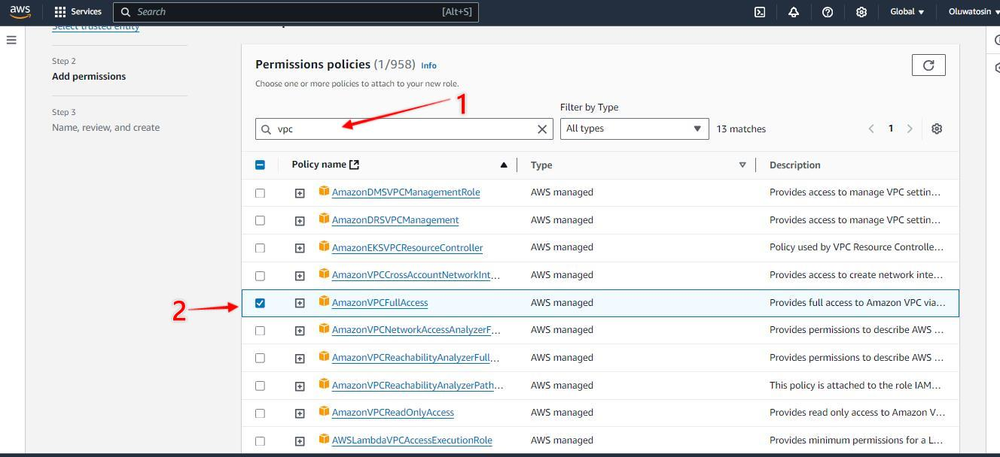
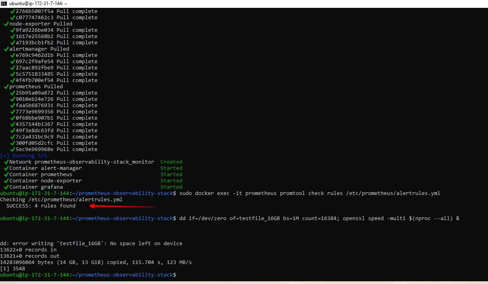
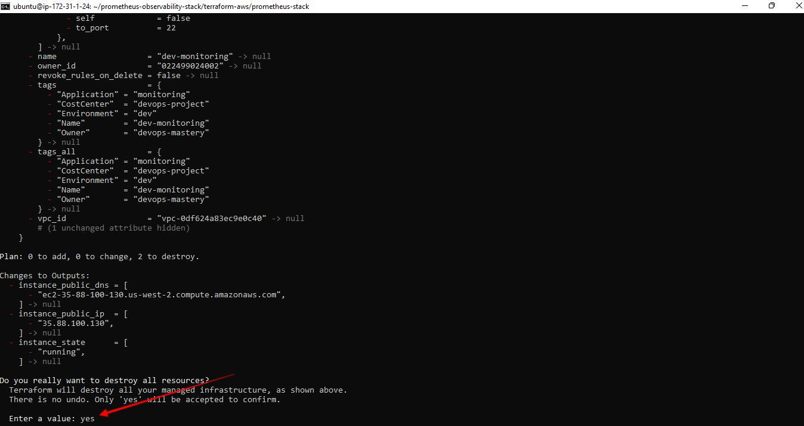

<h1> Project 10</h1>

<h2>Spin up an Ubuntu 24.04 EC2 instance we shall be using it for this project
Connect your instance via ssh</h2>

Clone the project repository to your instance

<code>git clone https://github.com/TobiOlajumoke/prometheus-observability-stack</code>
The project code is present in the prometheus-observability-stack folder. cd into the folder.

<code>cd prometheus-observability-stack</code>
Note: Use visual studio code or relevant IDE to understand the code structure better.

Here is the project structure and config files:
<code>

├── Makefile
├── README.md
├── alertmanager
│   └── alertmanager.yml
├── docker-compose.yml
├── prometheus
│   ├── alertrules.yml
│   ├── prometheus.yml
│   └── targets.json
└── terraform-aws
    ├── README.md
    ├── modules
    │   ├── ec2
    │   │   ├── main.tf
    │   │   ├── outputs.tf
    │   │   ├── user-data.sh
    │   │   └── variables.tf
    │   └── security-group
    │       ├── main.tf
    │       ├── outputs.tf
    │       └── variables.tf
    ├── prometheus-stack
    │   ├── main.tf
    │   ├── outputs.tf
    │   └── variables.tf
    └── vars
        └── ec2.tfvars </code>

<h4>To do this project you need to have the following.</h4>

A Valid AWS account with full permissions to create and manage AWS VPC service.
Setup terraform on an ec2 instance, ensure you have a valid IAM role attached to the instance with VPC provisioning permissions.
We are going to spin up an ec2 instance and attach the following IAM roles to it:

&#x2022;AmazonVPCFullAccess
&#x2022;AmazonEC2FullAccess

<h3>Now create an EC2 instance, Ubuntu 22.04</h3>  
<h3>let us the attach the role created earlier to the instance</h3>

<h3>Connect to your instance via ssh</h3>

&#x2022; ssh into the instance
&#x2022; install terraform
<code>sudo snap install terraform --classic</code>

<h3>Provision Server Using Terraform</h3>
Modify the values of ec2.tfvars file present in the terraform-aws/vars folder. You need to replace the values highlighted in bold with values relevant to your AWS account & region.

<code>cd terraform-aws/vars</code>
If you are using us-west-2, you can continue with the same AMI ID else change the AMI ID

<code>vi ec2.tfvars</code>

<code>
# EC2 Instance Variables
region         = "us-west-2"
ami_id         = "ami-0aff18ec83b712f05"
instance_type  = "t2.large"
key_name       = "add keyname"
instance_count = 1
volume-size = 20

# VPC id
vpc_id  = "add a vpc"
subnet_ids     = "add a subnet"

# Ec2 Tags
name        = "prometheus-stack"
owner       = "devops-mastery"
environment = "dev"
cost_center = "devops-project"
application = "monitoring"

# CIDR Ingress Variables
create_ingress_cidr        = true
ingress_cidr_from_port     = [22, 80, 443, 9090, 9100, 9093, 3000]  # List of from ports
ingress_cidr_to_port       = [22, 80, 443, 9090, 9100, 9093, 3000]  # List of to ports
ingress_cidr_protocol      = ["tcp", "tcp", "tcp", "tcp", "tcp", "tcp", "tcp"]        # Protocol for all rules (you can add more if needed)
ingress_cidr_block         = ["0.0.0.0/0", "0.0.0.0/0", "0.0.0.0/0", "0.0.0.0/0", "0.0.0.0/0", "0.0.0.0/0", "0.0.0.0/0"]
ingress_cidr_description   = ["SSH", "HTTP", "HTTPS", "Prometheus", "Node-exporter", "Alert manager", "Grafana"]

# CIDR Egress Variables
create_egress_cidr    = true
egress_cidr_from_port = [0]
egress_cidr_to_port   = [0]
egress_cidr_protocol  = ["-1"]
egress_cidr_block     = ["0.0.0.0/0"]
</code>

Now I can provision the AWS EC2 & Security group using Terraform.

<code>cd ../prometheus-stack</code>

<code>terraform fmt</code>

<code>terraform init</code>

<code>terraform validate</code>

After execute the plan and apply the changes.

<code>terraform plan --var-file=../vars/ec2.tfvars</code>

<code>terraform apply --var-file=../vars/ec2.tfvars</code>

Now I can connect to the AWS EC2 machine just created via ssh.

#### CONNECT TO YOUR NEW INSTANCE

&#x2022; running the following command on our instance
We will check the cloud-init logs to see if the user data script has run successfully.

<code>tail /var/log/cloud-init-output.log</code>
An example output is shown below. It should show Docker and Docker compose versions as highlighted in the image.

To verify the docker and docker-compose versions again.

<code>sudo docker version</code>

<code>sudo docker-compose version</code>

### Deploy Prometheus Stack Using Docker Compose

<code>git clone https://github.com/TobiOlajumoke/prometheus-observability-stack</code>

<code>cd prometheus-observability-stack</code>

Execute the following make command to update server IP in prometheus config file. Because we are running the node exporter on the same server to fetch the server metrics. We also update the alert manager endpoint to the servers public IP address.

<code>make all</code>

Bring up the stack using Docker Compose. It will deploy Prometheus, Alert manager, Node exporter and Grafana
sudo docker-compose up -d

<code>sudo docker-compose up -d</code>
On a successful execution, you should see the following output saying Running 5/5

Now, with your servers IP address you can access all the apps on different ports.

&#x2022;Prometheus: <a href>http://your-public-ip-address:9090</a>
&#x2022;Alert Manager:<a href> http://your-public-ip-address:9093</a>
&#x2022;Grafana: <a href>http://your-public-ip-address:3000</a>
Now the stack deployment is done. The rest of the configuration and testing will be done the using the GUI.

### Validate Prometheus Node Exporter Metrics
If you visit <a href>http://your-public-ip-address:9090</a>, you will be able to access the Prometheus dashboard as shown below.

Validate the targets, rules and configurations as shown below. The target would be Node exporter url.

validating prometheus rules and targets
Now lets execute a promQL statement to view node_cpu_seconds_total metrics scrapped from the node exporter.

<code>avg by (instance,mode) (irate(node_cpu_seconds_total{mode!='idle'}[1m]))</code>

#### Configure Grafana Dashboards
Now lets configure Grafana dashboards for the Node Exporter metrics.

Grafana can be accessed at: <a href>http://your-ip-address:3000</a>

Use admin as username and password to login to Grafana. You can update the password in the next window if required.

Now we need to add prometheus URL as the data source from Connections→ Add new connection→ Prometheus → Add new data source.

Here is the demo.

#### Configure Node Exporter Dashboard
Grafana has many node exporter pre-built templates that will give us a ready to use dashboard for the key node exporter metrics.

To import a dashboard, go to Dashboards –> Create Dashboard –> Import Dashboard –> Type 10180 and click load –> Select Prometheus Data source –> Import

Here is the demo.

#### Simulate & Test Alert Manager Alerts

You can access the Alertmanager dashbaord on <a href>http://your-ip-address:9093</a>

Alert rules are already backed in to the prometheus configuration through alertrules.yaml. If you go the alerts option in the prometheus menu, you will be able to see the configured alerts as shown below. <a href> http://your-ip-address:9090</a>

As you can see, all the alerts are in inactive stage. To test the alerts, we need to simulate these alerts using few linux utilities.

You can also check the alert rules using the native promtool prometheus CLI. We need to run promtool command from inside the prometheus container as shown below. run the commands below in the prometheus server

<code>sudo docker exec -it prometheus promtool check rules /etc/prometheus/alertrules.yml</code>

Now let’s rollback the changes and see the fired alerts has been resolved.

<code>rm testfile_16GB && kill $(pgrep openssl)</code>
#### Test: High Storage & CPU Alert
<code>dd if=/dev/zero of=testfile_16GB bs=1M count=16384; openssl speed -multi $(nproc --all) &</code>

#### Cleanup The Setup
To tear down the setup, execute the following terraform command from your workstation.

<code>cd prometheus-observability-stack/terraform-aws/prometheus-stack</code>

<code>terraform destroy --var-file=../vars/ec2.tfvars</code>
enter 'yes'

I Terminated the ec2 instances

THE END OF PROJECT