<h1> Project 3: Setup Load Balancing for Static Website Using Nignx</h1>
<h4>This project aims to teach Layer 7 load balancing and load balancing algorithms using Nginx as a Load Balancer. </h4>

<h3> Documentation </h3>
<h4> Picking reference from Project1, for guidance on spinning up an Ubuntu server, i was able to create and associate an elastic IP address with your server. </h4>

 &#x2022; Spin up your 3 ubuntu servers. Ensure you clearly name them so you don't make mistakes.

 

 The next step was to Download my website template from my preferred website by navigating to the website, locating the template want.

  &#x2022;Right click and select <b>Inspect </b> from the drop down menu, the navigate to Network tab.

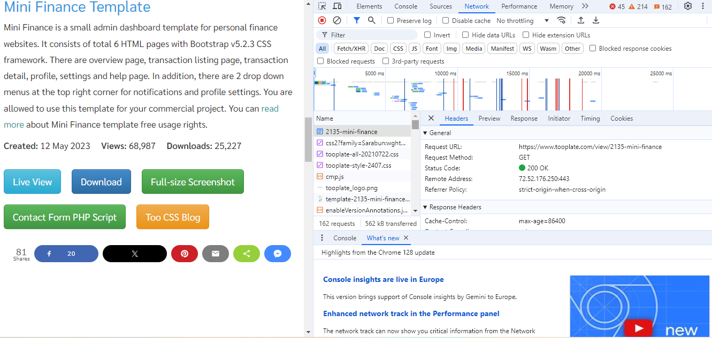.

 &#x2022; 
 Click the Download button and right click on the website name, then select Copy and click on Copy URL.

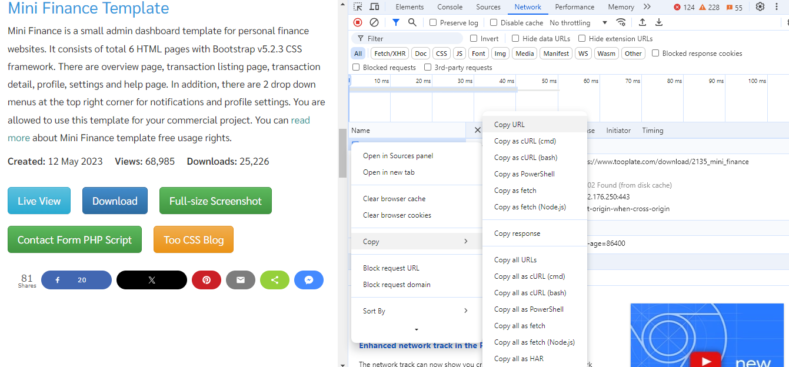

&#x2022; 
 To bring Nginx in to the picture, i need to install Nginx, by execute the following commands on my terminal.

<code>sudo apt update </code>

<code>sudo apt upgrade </code>

<code>sudo apt install nginx </code>

&#x2022; 
o Start Nginx server, I ran the <code> sudo systemctl start nginx </code> command, enable it to start on boot by executing <code> sudo systemctl enable nginx </code>, and then confirm if it's running with the <<code> >sudo systemctl status nginx </code> command.

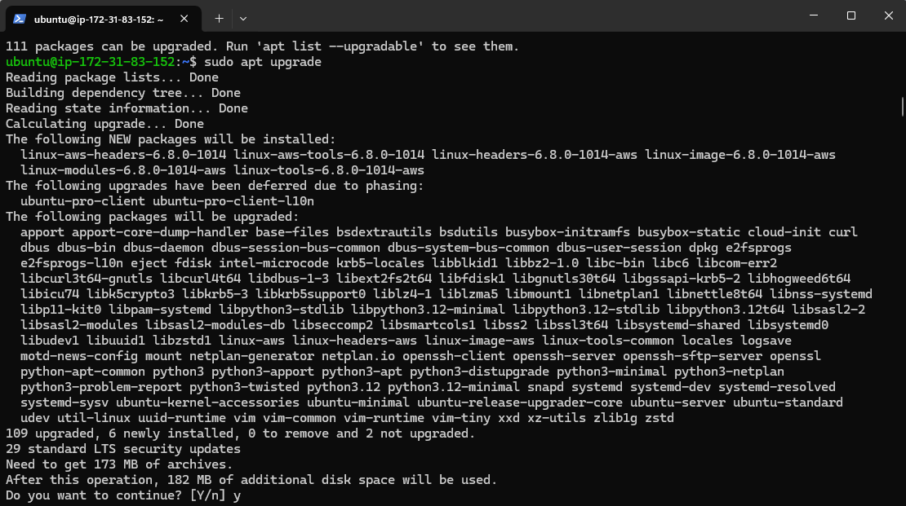

 

 

&#x2022; 
 To confirm if what i was doing was right, I waka go my instances IP address in a web browser to observe the default Nginx startup page.

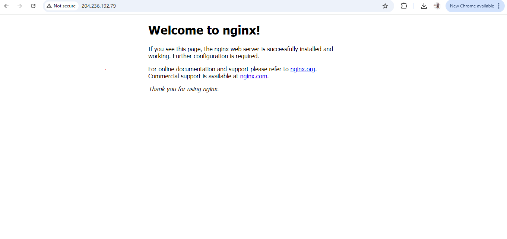

 &#x2022; 
 Execute sudo apt install unzip to install the unzip tool and run the following command to download and unzip your website files <code> sudo curl -o /var/www/html/2135_mini_finance.zip https://www.tooplate.com/zip-templates/2135_mini_finance.zip && sudo unzip -d /var/www/html/ /var/www/html/2135_mini_finance.zip && sudo rm -f /var/www/html/2135_mini_finance.zip. </code>

 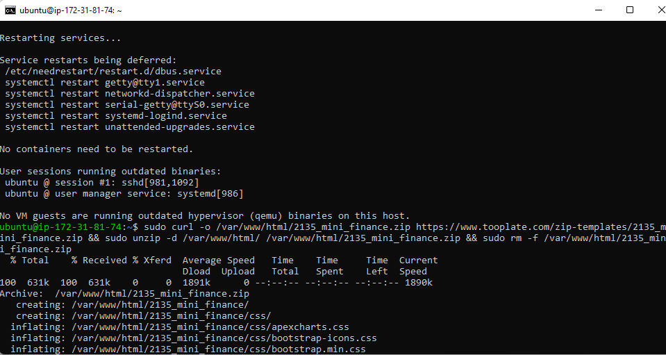

 &#x2022; 
 To set up your website's configuration, start by creating a new file in the Nginx sites-available directory. Use the following command to open a blank file in a text editor: sudo nano /etc/nginx/sites-available/finance.

 &#x2022; 
 after Copying and pasting the following code from the documentation file into the open text editor and editing the root directive, it I had this below:

 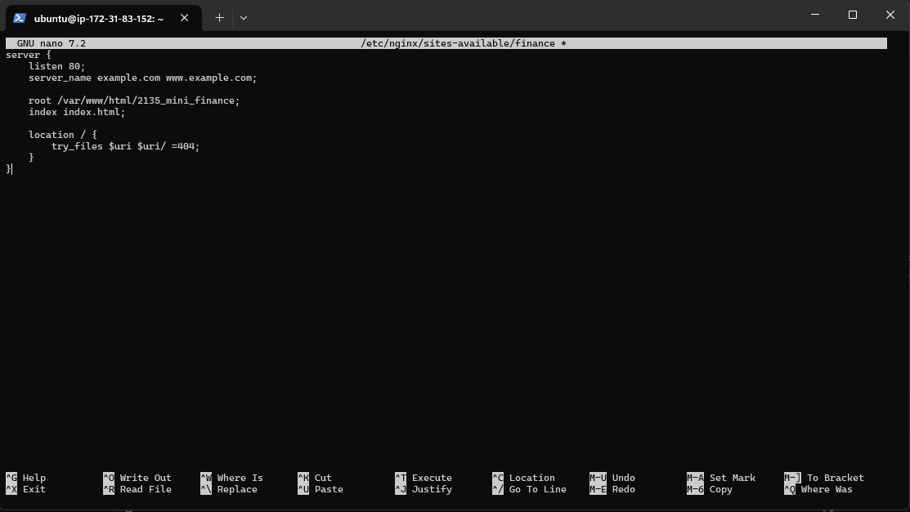

 &#x2022; 
 For me to create a symbolic link for both websites, I ran the following command. <code> sudo ln -s /etc/nginx/sites-available/finance</code> <code>/etc/nginx/sites-enabled/ </code>

 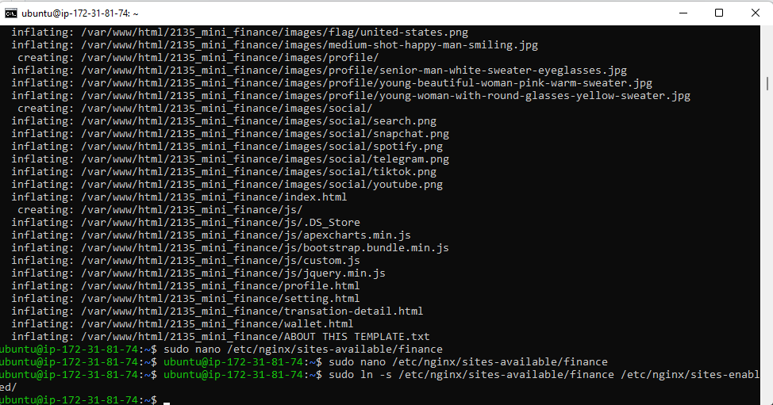

 &#x2022; 
 To check the syntax of the Nginx configuration file, I ran <code>sudo nginx -t </code> command and when it was successful, I then ran the <code>sudo systemctl restart nginx </code>command.

 

 &#x2022; 
 I repeated the process for the second website (Interior).

 I executed <code>sudo apt install unzip to install the unzip tool and run the following command to download and unzip your website files sudo curl -o /var/www/html/2133_moso_interior.zip https://www.tooplate.com/zip-templates/2133_moso_interior.zip && sudo unzip -d /var/www/html/ /var/www/html/2133_moso_interior.zip && sudo rm -f /var/www/html/2133_moso_interior.zip </code>.

 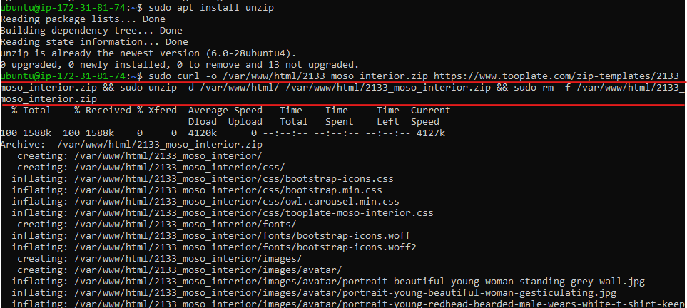

&#x2022; 
 To set up your website's configuration, I started by creating a new file in the Nginx sites-available directory. and entered this code <code>>sudo nano /etc/nginx/sites-available/interior</code> into a new file and editted it.

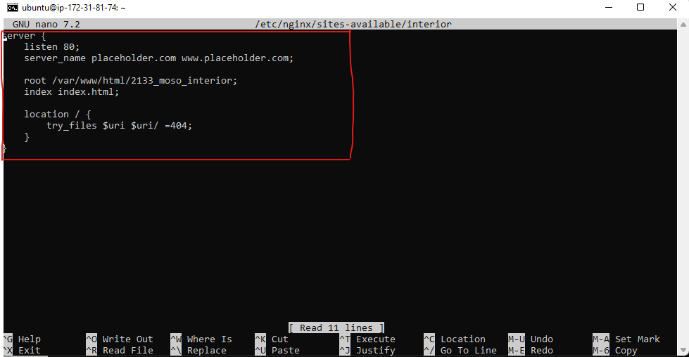

&#x2022; 
 To Create a symbolic link for both websites I ran <code> sudo ln -s /etc/nginx/sites-available/interior /etc/nginx/sites-enabled/</code>.

&#x2022; 
 To check the  syntax of the Nginx configuration file I ran <code>sudo nginx -t</code>, and when successful I ran the <code>sudo systemctl restart nginx</code>command.

&#x2022; 
 For me to see if both websites never jam Danfo, I Checked both IP addresses to confirm your website is up and greatful.
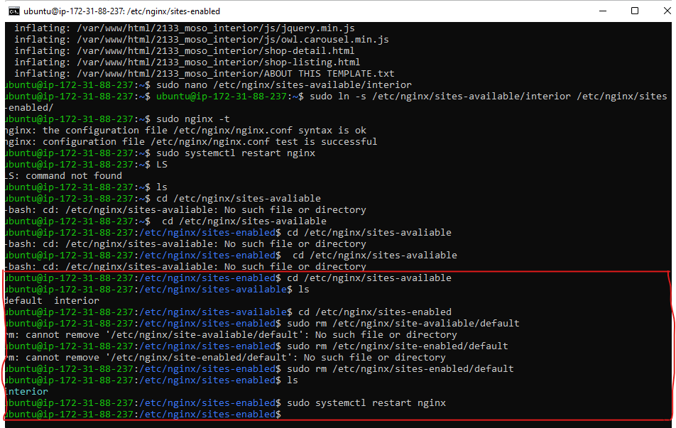

<h2> Configure your Load balancer </h2>
&#x2022; 
 Install Nginx on the server you want to use as a load balancer, and execute sudo systemctl status nginx to ensure it's running.

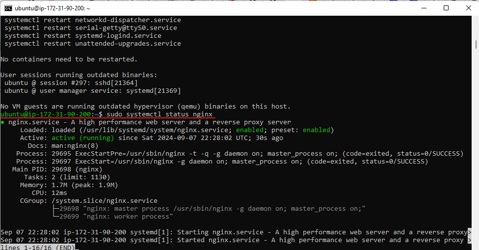

&#x2022; 
 Execute <code>sudo nano /etc/nginx/nginx.conf</code> to edit your Nginx configuration file.

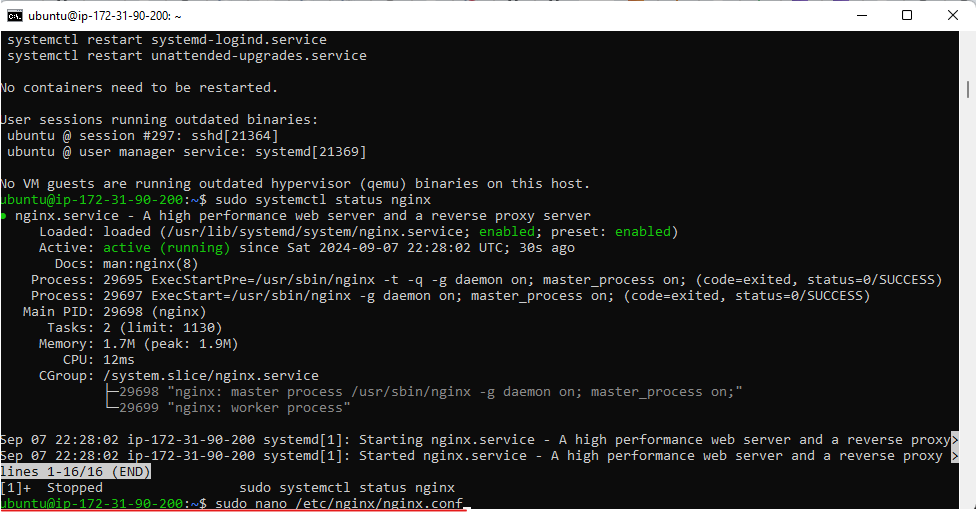

&#x2022; 
 By copying and editing the code in Documentation file 

&#x2022; 
For zero headaches and the heart doing gbim gbim, run <code>sudo nginx -t</code> to check for syntax error.

<h1> Create An A Record </h1>

<h3> To make your website accessible via your domain name and not the IP address, I set up a DNS record hostinger.co.uk  , and then moving hosting to AWS Route 53, where I set up an A record.

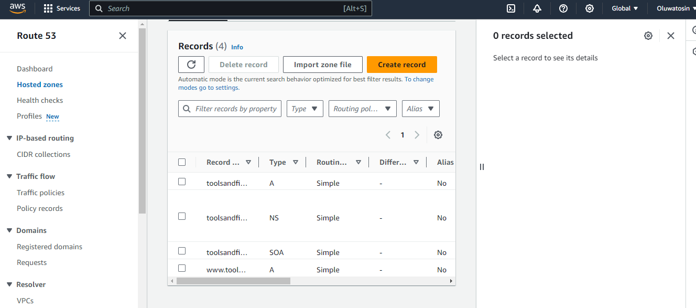

To check if the website show up using the domian name, first i restarted Nginx by running <code>sudo systemctl restart nginx</code> command.

#### Headache done dey arise again, God abeg!