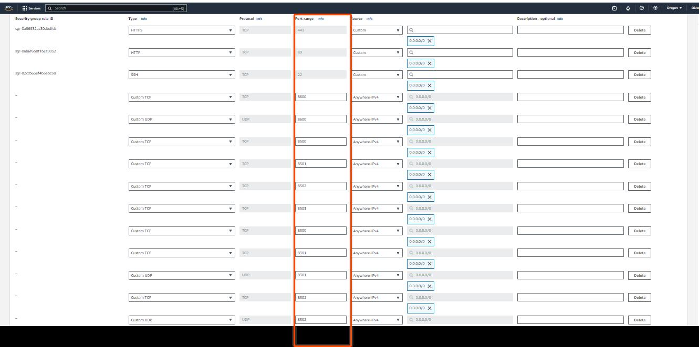
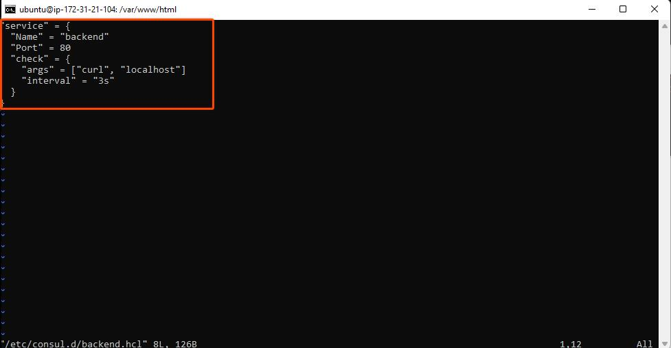

<h1> Project 5 Documentation </h1>
Please reference Project1 for guidance on spinning up an Ubuntu server.

 &#x2022; Rename your EC2 instances to prevent any confusion during your project.

 &#x2022; Click on the edit icon to change the name of each instance

 &#x2022; Select the checkbox next to your instance, click on Security, and then click on the security group ID.

 &#x2022; Click on Edit inbound rules.

 
 &#x2022; Click on Add rule.
 

 
 &#x2022; Enter the Port range.

 
 &#x2022; Choose the appropriate CIDR block.

 
 &#x2022;Click on Add Rule to specify the port range for the UDP protocol.

 &#x2022; Click on the Type field① and choose Custom UDP② from the dropdown menu.

 &#x2022; Enter the Port range and choose the CIDR blocks. 

Verify that all the necessary ports are open.

 &#x2022;Click on Save rules to apply the updated security group settings.

### Setup Consul Server

 &#x2022;SSH into the consul server and run sudo apt update to refresh the package cache.

 &#x2022;Visit the consul downloads page to copy the installation command.

 &#x2022; Or execute the following commands to install Consul.

<code>wget -O- https://apt.releases.hashicorp.com/gpg | gpg --dearmor | sudo tee /usr/share/keyrings/hashicorp-archive-keyring.gpg

echo "deb [signed-by=/usr/share/keyrings/hashicorp-archive-keyring.gpg] https://apt.releases.hashicorp.com $(lsb_release -cs) main" | sudo tee /etc/apt/sources.list.d/hashicorp.list

sudo apt update && sudo apt install consul </code>

 &#x2022; Confirm Consul installation by checking its version with the consul --version command.

 &#x2022;All the Consul server configurations are located in the <code>/etc/consul.d </code>folder. To configure the Consul server, start by backing up the default configuration file consul.hcl by renaming it to consul.hcl.back, using the following command: <code>sudo mv /etc/consul.d/consul.hcl /etc/consul.d/consul.hcl.back</code>

 &#x2022; Generate an encrypted key using the consul keygen command.

 &#x2022; Create a new file named consul.hcl in the /etc/consul.d directory, using the following command: <code>sudo vi /etc/consul.d/consul.hcl</code>

 &#x2022; Add the following content to the consul.hcl file, replacing <YOUR_ENCRYPTED_KEY> with the encrypted key you generated:

<code>"bind_addr" = "0.0.0.0"
"client_addr" = "0.0.0.0"
"data_dir" = "/var/consul"
"encrypt" = "<YOUR_ENCRYPTED_KEY>"
"datacenter" = "dc1"
"ui" = true
"server" = true
"log_level" = "INFO" </code>

 &#x2022; Run the following command to start the Consul server in the background: <code>sudo nohup consul agent -dev -config-dir /etc/consul.d/ &. </code>

 &#x2022;You can check the status of the Consul server with the following command: <code>consul members</code>.

 &#x2022;If you visit <code><EC2 Consul Server IP></code>:8500, you should be able to access the Consul dashboard.

### Setup Backend Servers

 &#x2022;Since we have the Consul server up and running, let's manage our Nginx backend servers more easily using service discovery. To do this, we'll install Nginx and the Consul agent on all the backend servers. The Consul agent acts like a messenger, automatically registering both the server and the Nginx service running on it with the Consul server, which acts like a central directory.

 &#x2022;Apply the configurations below on both backend servers:

 &#x2022;SSH into the backend servers and run <code>sudo apt-get update -y </code>to update package information.

 &#x2022;Install Nginx on both instances by running the following command:  <code>sudo apt install nginx -y </code>.

 &#x2022; Navigate to the HTML directory by executing the following command: <code>cd /var/www/html</code>.

 &#x2022;Open the HTML file with your preferred text editor to make edits: <code>sudo vi index.html</code>.

 &#x2022;Copy the HTML content below into the index.html file. On the second server, replace <code>SERVER-01</code> with <code>SERVER-02</code> in the HTML file to differentiate between the two backend servers.

<code>
<!DOCTYPE html>
<html>
<head>
	<title>Kanekis Backend Server </title>
</head>
<body>
	<h1>This is Backend SERVER-01</h1>
</body>
</html> </code>

 &#x2022; Install Consul as an agent on the servers. Run the following commands to install Consul:

<code> wget -O- https://apt.releases.hashicorp.com/gpg | gpg --dearmor | sudo tee /usr/share/keyrings/hashicorp-archive-keyring.gpg

echo "deb [signed-by=/usr/share/keyrings/hashicorp-archive-keyring.gpg] https://apt.releases.hashicorp.com $(lsb_release -cs) main" | sudo tee /etc/apt/sources.list.d/hashicorp.list

sudo apt update && sudo apt install consul </code>

 &#x2022; Verify that Consul is installed properly by running the following command: <code>consul --version </code>.

 &#x2022; Replace the default Consul configuration file <code>config.hcl</code> located in <code>/etc/consul.d </code>with your custom <code>consul.hcl</code> file.

 &#x2022;Rename the default file and create a new one by running the following commands:

<code>sudo mv /etc/consul.d/consul.hcl /etc/consul.d/consul.hcl.back
sudo vi /etc/consul.d/consul.hcl </code>

 &#x2022; Add the following contents to the file. Replace <YOUR_ENCRYPTED_KEY> with your encryption key. Also, replace 34.201.77.72 with your Consul server's IP address.

 
<code>"server" = false
"datacenter" = "dc1"
"data_dir" = "/var/consul"
"encrypt" = "<YOUR_ENCRYPTED_KEY>"
"log_level" = "INFO"
"enable_script_checks" = true
"enable_syslog" = true
"leave_on_terminate" = true
"start_join" = ["34.201.77.72"] </code>

 &#x2022;Add the following contents to the backend.hcl file and save it.
<code>
"service" = {
  "Name" = "backend"
  "Port" = 80
  "check" = {
    "args" = ["curl", "localhost"]
    "interval" = "3s"
  }
}
</code>

This configuration registers your backend servers with the Consul server and sets up a health check that uses curl to test the service every 3 seconds.

 &#x2022;Verify the configurations by executing the following command: <code>consul validate /etc/consul.d.</code>

 &#x2022;Once all configurations are complete, start the Consul agent with the following command: <code>sudo nohup consul agent -config-dir /etc/consul.d/ &.<code>

 &#x2022;To verify if everything is working correctly, visit your Consul UI. If you see the backend listed in the UI as depicted below, it indicates that the backend has successfully registered itself with Consul.

### Setup Load-Balancer

Next, set up the load balancer to automatically update its backend server information based on the service registry maintained by Consul. To retrieve the backend server details, we will use the consul-template binary. This tool interacts with the Consul server via API calls to fetch the backend server information. It then uses a template to substitute values and generate the loadbalancer.conf file, which is utilized by Nginx.

Log in to the load-balancer server. Update the package information and install unzip with the following commands:

<code> sudo apt-get update -y
sudo apt-get install unzip -y </code>

 &#x2022;Install Nginx using the following command: <code>sudo apt install nginx -y</code>.

 &#x2022; Download the consul-template binary using the following command:
<code>sudo curl -L  https://releases.hashicorp.com/consul-template/0.30.0/consul-template_0.30.0_linux_amd64.zip -o /opt/consul-template.zip

sudo unzip /opt/consul-template.zip -d  /usr/local/bin/ </code>

 &#x2022; To verify the installation of consul-template, check its version with the following command: <code>consul-template --version</code>.

 &#x2022;Create and edit a file named <code>load-balancer.conf.ctmpl</code> in the <code>/etc/nginx/conf.d</code> directory, using the following command: <code>sudo vi /etc/nginx/conf.d/load-balancer.conf.ctmpl</code>.

Paste the following content into the file:
<code>
upstream backend {
 {{- range service "backend" }} 
  server {{ .Address }}:{{ .Port }}; 
 {{- end }} 
}

server {
   listen 80;

   location / {
      proxy_pass http://backend;
   }
} </code>

The default server configuration file should be deleted to avoid inconsistencies with the server's settings.
Restart Nginx to apply the changes by running the following command: <code>sudo systemctl restart nginx</code>.

 &#x2022; Once configurations are complete, start the Consul Template agent using the following command. It continuously monitors Consul for changes.

<code> sudo nohup consul-template -config=/etc/nginx/conf.d/consul-template.hcl &</code>

 &#x2022; Upon completion, a load-balancer.conf file will be created with backend server information populated from the Consul service registry.

Now, if you access the load balancer IP in your web browser, it will display the custom HTML content from one of the backend servers. When you refresh the page, the load balancer will route your request to the other backend server, displaying its custom HTML content.

