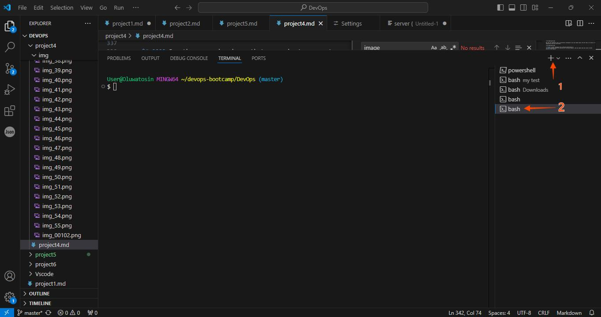
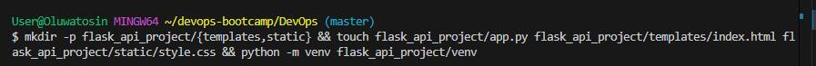
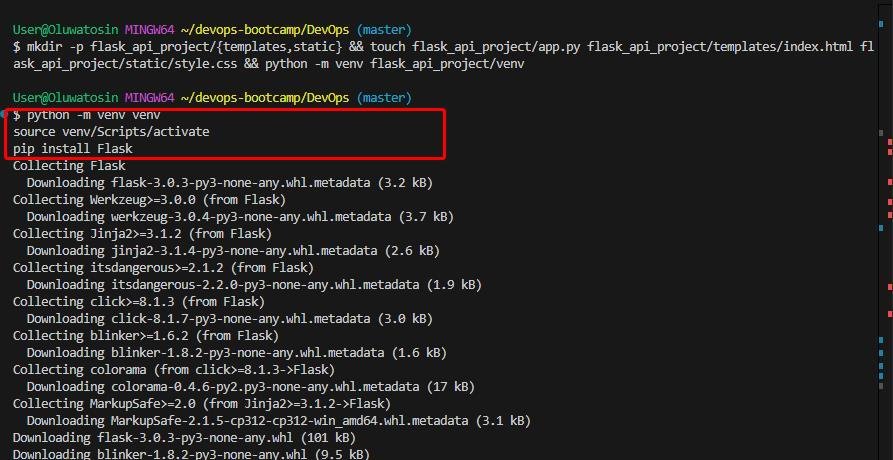
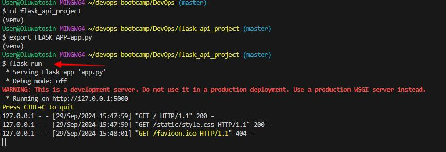
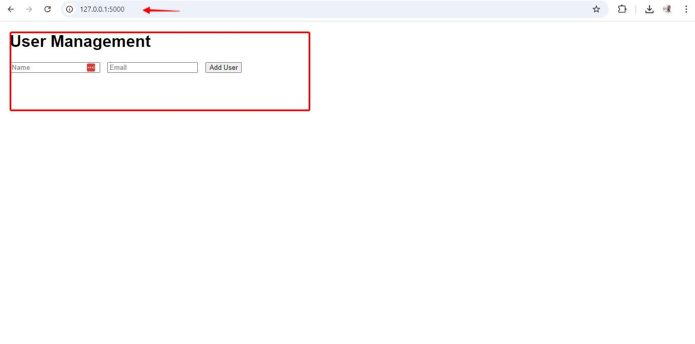
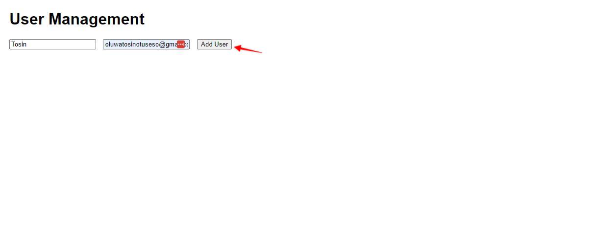
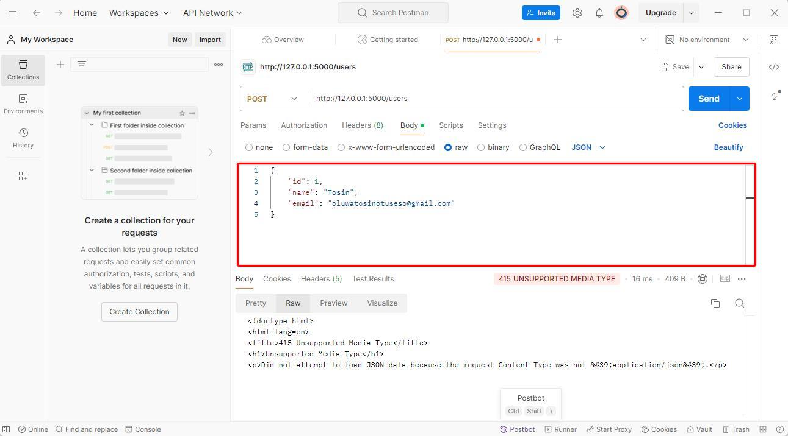
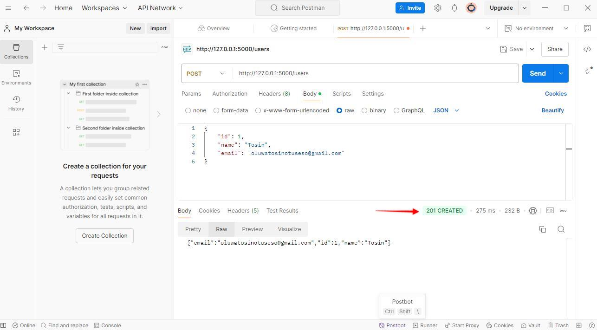

<h1> Project 6, Documentation</h1>
<h3>Setting Up the Project </h3>
To start the project directory structure and set up a virtual environment, I opened my VScode command line git bash ell:

 &#x2022; To open up your terminal in VScode
Use the shortcut "Ctrl + ` " (backtick key). - Windows users

### Using gitbash
<code> mkdir -p flask_api_project/{templates,static} && touch flask_api_project/app.py flask_api_project/templates/index.html flask_api_project/static/style.css && python -m venv flask_api_project/venv</code>

The command above will create the project enviroment

 &#x2022; In the app.py file paste the code below

<code> from flask import Flask, request, jsonify, render_template

app = Flask(__name__)

users = []

@app.route('/')
def home():
    return render_template('index.html')

@app.route('/users', methods=['POST'])
def create_user():
    user = request.get_json()
    users.append(user)
    return jsonify(user), 201

@app.route('/users', methods=['GET'])
def get_users():
    return jsonify(users), 200

@app.route('/users/<int:user_id>', methods=['GET'])
def get_user(user_id):
    user = next((u for u in users if u['id'] == user_id), None)
    return jsonify(user), 200 if user else 404

@app.route('/users/<int:user_id>', methods=['PUT'])
def update_user(user_id):
    user = request.get_json()
    index = next((i for i, u in enumerate(users) if u['id'] == user_id), None)
    if index is not None:
        users[index] = user
        return jsonify(user), 200
    return '', 404

@app.route('/users/<int:user_id>', methods=['DELETE'])
def delete_user(user_id):
    global users
    users = [u for u in users if u['id'] != user_id]
    return '', 204

if __name__ == '__main__':
    app.run(debug=True) </code>

2 In the index.html in the templates directory paste the code below:
<code>
<!DOCTYPE html>
<html lang="en">
<head>
    <meta charset="UTF-8">
    <meta name="viewport" content="width=device-width, initial-scale=1.0">
    <title>API-Based Application</title>
    <link rel="stylesheet" href="{{ url_for('static', filename='style.css') }}">
</head>
<body>
    <h1>User Management</h1>
    <form id="userForm">
        <input type="text" id="name" placeholder="Name" required>
        <input type="email" id="email" placeholder="Email" required>
        <button type="submit">Add User</button>
    </form>
    <ul id="userList"></ul>

    
</body>
</html> </code>

3 In the style.css in the static directory paste this code below there:
<code>
body {
    font-family: Arial, sans-serif;
    margin: 20px;
}

form {
    margin-bottom: 20px;
}

input {
    margin-right: 10px;
} </code>

### Step 3: Running the Application

I entered the following command in VScode
<code>
python -m venv venv
source venv/Scripts/activate
pip install Flask</code>

Run your Flask application:

<code>flask run</code>

### Step 4: Testing the API
I opened the postman app on my windows, and entered the following code inJson format after creating a new request.

 &#x2022; Go to the Body tab, select raw, and choose JSON from the dropdown.

 &#x2022; Enter the JSON data:

<code>{
    "id": 1,
    "name": "your name",
    "email": "yourname@example.com"
} </code>

 &#x2022;Click Send and check the response.

