<h1> Project 8</h1>

### This guide provides an overview of key Terraform commands to help you manage your infrastructure efficiently.
#### terraform init
<code>terraform init </code>
&#x2022; Purpose: Initializes a new or existing Terraform working directory.

Usage: Prepares your directory for Terraform operations by downloading necessary provider plugins.

### terraform plan
<b>Purpose</b>: Creates an execution plan showing what changes Terraform will make to your infrastructure.

&#x2022;<b>Usage</b>: Review planned changes before applying them.

<code>terraform plan</code>

### <b>terraform apply</b>
<b>Purpose</b>: Applies the changes required to reach the desired state as defined in your configuration files.

<b>Usage</b>: Executes the actions proposed by terraform plan.

<code>terraform apply</code>

### <b>terraform destroy</b>
<b>Purpose</b>: Destroys the Terraform-managed infrastructure.

<b>Usage</b>: Removes all resources defined in your configuration files.

<code>terraform destroy</code>

### <b>terraform validate</b>
<b>Purpose</b>: Validates the configuration files for syntax and internal consistency.

<b>Usage</b>: Checks for errors before running other commands.

<code>terraform validate</code>

### terraform fmt
<b>Purpose</b>: Formats Terraform configuration files to follow a canonical style.

<b>Usage</b>: Ensures consistent formatting of your configuration files.

<code>terraform fmt</code>

### <b>terraform show</b>
<b>Purpose</b>: Displays a human-readable output of the state or plan.

<b>Usage</b>: Inspects the current state or details of a plan.

<code>terraform show</code>

### <b>terraform output</b>
<b>Purpose</b>: Reads and displays the values of output variables from the state file.

<b>Usage</b>: Accesses outputs defined in your configuration.

<b>terraform output</b>

### <b>terraform state</b>
<b>Purpose</b>: Advanced management of the Terraform state file.

<b>Usage</b>: Includes subcommands to inspect and modify the state.

<code>terraform state list</code>

## To do this project you need to have the following.
 
&#x2022;A Valid AWS account with full permissions to create and manage AWS VPC service.
 Setup terraform on an ec2 instance, ensure you have a valid IAM role attached to the instance with VPC provisioning permissions.
 We are going to spin up an ec2 instance and attach the following IAM roles to it:

&#x2022; AmazonVPCFullAccess
&#x2022; AmazonEC2FullAccess

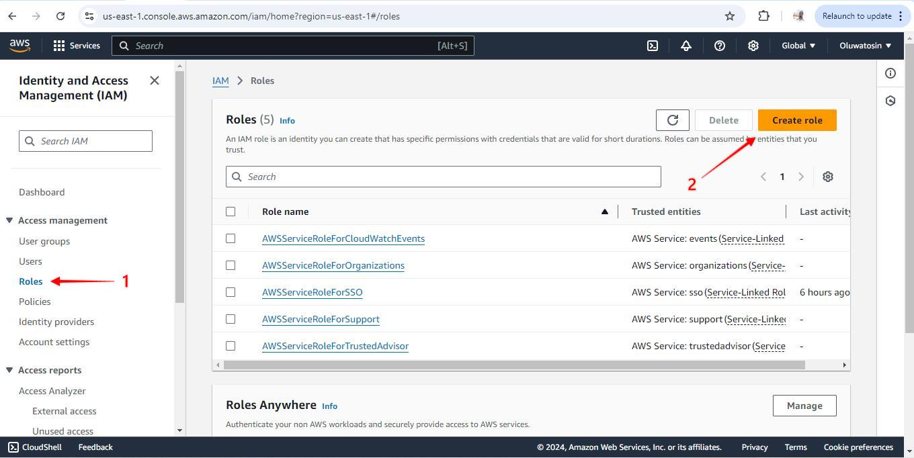

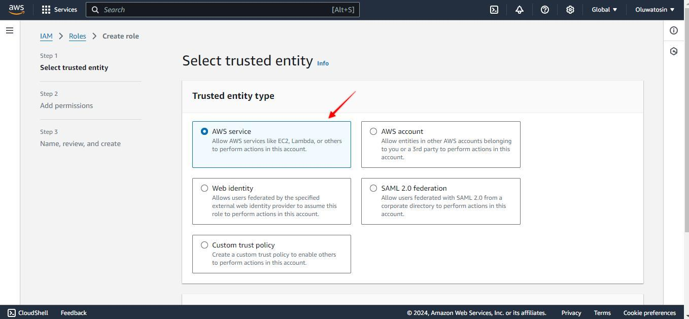

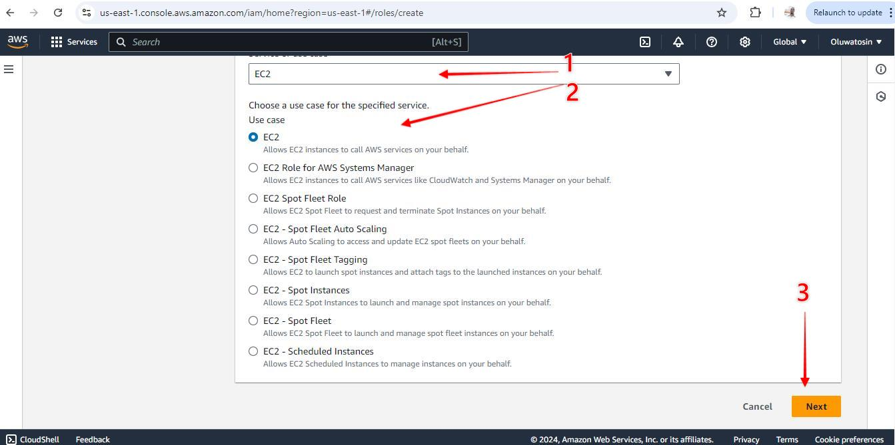

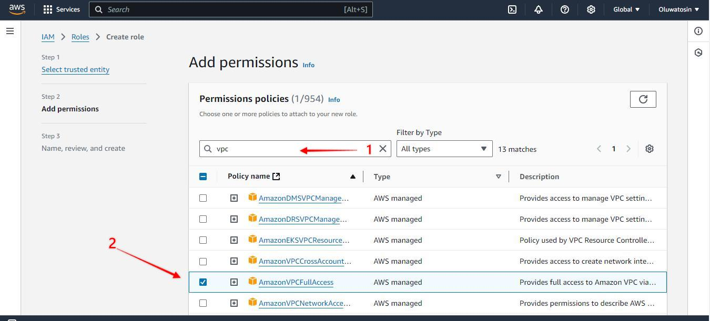

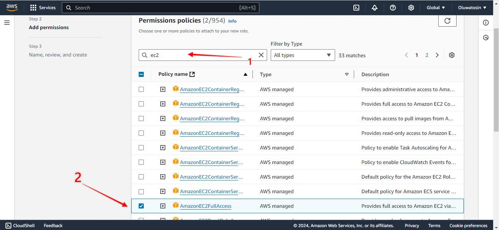

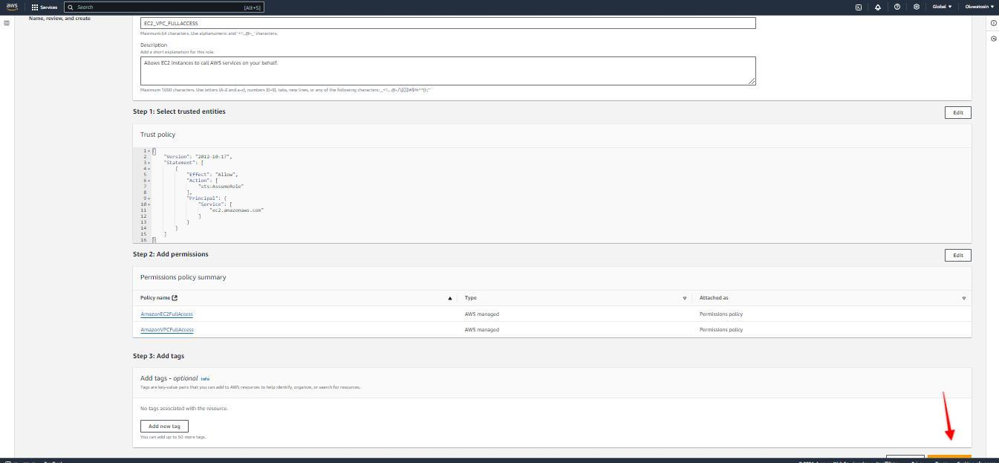

### I created an EC2 instance, Ubuntu 22.04
using the attached role created earlier to the instance

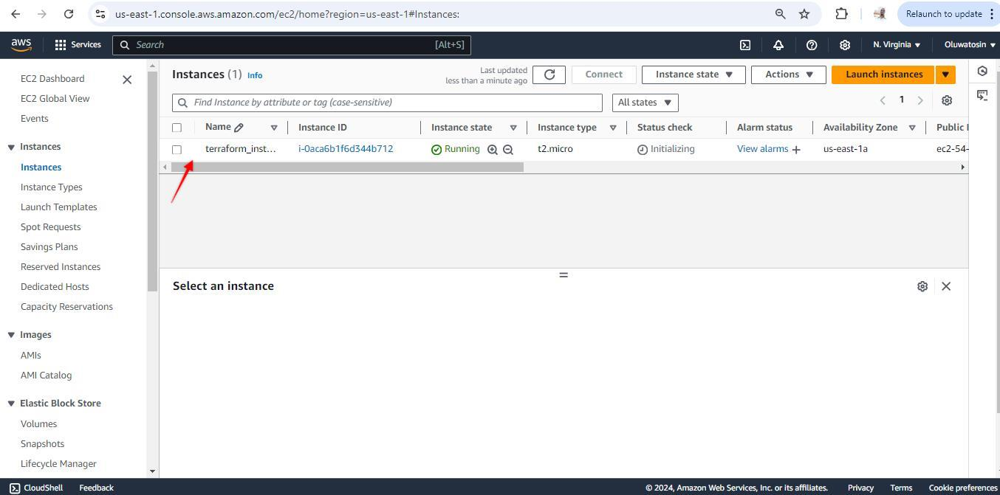

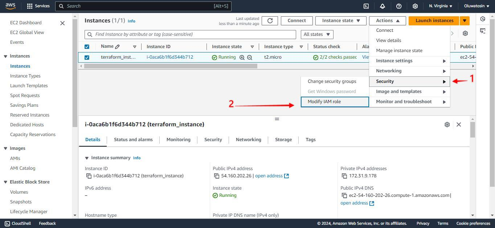

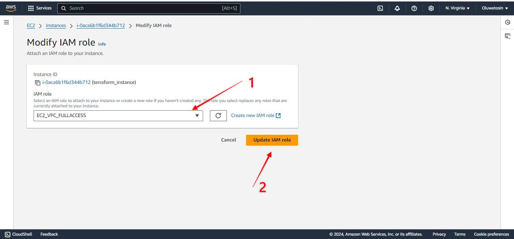

### Connect to your instance via ssh
&#x2022;ssh into the instance
&#x2022;install terraform
<code>sudo snap install terraform</code>

### Step 1: Clone thge repo into the instance and CD in the Cloned Repository
&#x2022; clone it using the following command.
<code>git clone https://github.com/TobiOlajumoke/Terraform-VPC.git</code>

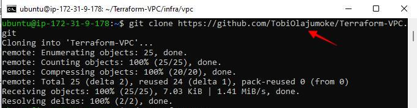

&#x2022; Then cd in to the terraform-vpc folder
<code>cd terraform-vpc</code>

&#x2022; The VPC terraform code is structured in the following way.
<code>
├── infra
│   └── vpc
│       ├── main.tf
│       └── variables.tf
├── modules
│   └── vpc
│       ├── endpoint.tf
│       ├── internet-gateway.tf
│       ├── nacl.tf
│       ├── nat-gateway.tf
│       ├── outputs.tf
│       ├── route-tables.tf
│       ├── subnet.tf
│       ├── variables.tf
│       └── vpc.tf
└── vars
    └── dev
        └── vpc.tfvars
</code>

vars folder contains the variables file named vpc.tfvars. It is the only file that needs modification

The modules/vpc folder contains the following VPC related resources. All the resource provisioning logic is part of these resources.

endpoint
internet-gateway
nacl
nat-gateway
route-tables
subnet
vpc The infra/vpc/main.tf file calls all the vpc module with all the VPC resources using the variables we pass using the vpc.tfvars file

### Step 2
&#x2022; cd into vars/dev/vpc.tfvars
&#x2022; using any text editor of my choice Nano or VIM and change the #tag owner to your name eg "Tosin" in this demo i used "DevOps"
<code>
#vpc
region               = "us-west-2"
vpc_cidr_block       = "10.0.0.0/16"
instance_tenancy     = "default"
enable_dns_support   = true
enable_dns_hostnames = true

#elastic ip
domain = "vpc"

#nat-gateway
create_nat_gateway = true

#route-table
destination_cidr_block = "0.0.0.0/0"

#tags
owner       = "Tosin"
environment = "dev"
cost_center = "DevOps-commerce"
application = "OpsApp"

#subnet

map_public_ip_on_launch       = true

public_subnet_cidr_blocks     = ["10.0.1.0/24", "10.0.2.0/24", "10.0.3.0/24"]
app_subnet_cidr_blocks        = ["10.0.4.0/24", "10.0.5.0/24", "10.0.6.0/24"]
db_subnet_cidr_blocks         = ["10.0.7.0/24", "10.0.8.0/24", "10.0.9.0/24"]
management_subnet_cidr_blocks = ["10.0.10.0/24", "10.0.11.0/24", "10.0.12.0/24"]
platform_subnet_cidr_blocks   = ["10.0.13.0/24", "10.0.14.0/24", "10.0.15.0/24"]
availability_zones            = ["us-west-2a", "us-west-2b", "us-west-2c"]

#public nacl

ingress_public_nacl_rule_no    = [100]
ingress_public_nacl_action     = ["allow"]
ingress_public_nacl_from_port  = [0]
ingress_public_nacl_to_port    = [0]
ingress_public_nacl_protocol   = ["-1"]
ingress_public_nacl_cidr_block = ["0.0.0.0/0"]

egress_public_nacl_rule_no    = [200]
egress_public_nacl_action     = ["allow"]
egress_public_nacl_from_port  = [0]
egress_public_nacl_to_port    = [0]
egress_public_nacl_protocol   = ["-1"]
egress_public_nacl_cidr_block = ["0.0.0.0/0"]

#app nacl

ingress_app_nacl_rule_no    = [100]
ingress_app_nacl_action     = ["allow"]
ingress_app_nacl_from_port  = [0]
ingress_app_nacl_to_port    = [0]
ingress_app_nacl_protocol   = ["-1"]
ingress_app_nacl_cidr_block = ["0.0.0.0/0"]

egress_app_nacl_rule_no    = [200]
egress_app_nacl_action     = ["allow"]
egress_app_nacl_from_port  = [0]
egress_app_nacl_to_port    = [0]
egress_app_nacl_protocol   = ["-1"]
egress_app_nacl_cidr_block = ["0.0.0.0/0"]

##db nacl

ingress_db_nacl_rule_no    = [100]
ingress_db_nacl_action     = ["allow"]
ingress_db_nacl_from_port  = [0]
ingress_db_nacl_to_port    = [0]
ingress_db_nacl_protocol   = ["-1"]
ingress_db_nacl_cidr_block = ["0.0.0.0/0"]

egress_db_nacl_rule_no    = [200]
egress_db_nacl_action     = ["allow"]
egress_db_nacl_from_port  = [0]
egress_db_nacl_to_port    = [0]
egress_db_nacl_protocol   = ["-1"]
egress_db_nacl_cidr_block = ["0.0.0.0/0"]

##management nacl

ingress_management_nacl_rule_no    = [100]
ingress_management_nacl_action     = ["allow"]
ingress_management_nacl_from_port  = [0]
ingress_management_nacl_to_port    = [0]
ingress_management_nacl_protocol   = ["-1"]
ingress_management_nacl_cidr_block = ["0.0.0.0/0"]

egress_management_nacl_rule_no    = [200]
egress_management_nacl_action     = ["allow"]
egress_management_nacl_from_port  = [0]
egress_management_nacl_to_port    = [0]
egress_management_nacl_protocol   = ["-1"]
egress_management_nacl_cidr_block = ["0.0.0.0/0"]

#platform nacl

ingress_platform_nacl_rule_no    = [100]
ingress_platform_nacl_action     = ["allow"]
ingress_platform_nacl_from_port  = [0]
ingress_platform_nacl_to_port    = [0]
ingress_platform_nacl_protocol   = ["-1"]
ingress_platform_nacl_cidr_block = ["0.0.0.0/0"]

egress_platform_nacl_rule_no    = [200]
egress_platform_nacl_action     = ["allow"]
egress_platform_nacl_from_port  = [0]
egress_platform_nacl_to_port    = [0]
egress_platform_nacl_protocol   = ["-1"]
egress_platform_nacl_cidr_block = ["0.0.0.0/0"]

#endpoint

create_s3_endpoint              = true
create_secrets_manager_endpoint = true
create_cloudwatch_logs_endpoint = true
<code>

###  Step 2: Initialize Terraform and Execute the Plan
&#x2022; Now cd in to infra/vpc folder and execute the terraform plan to validate the configurations.
<code>cd infra/vpc<code>

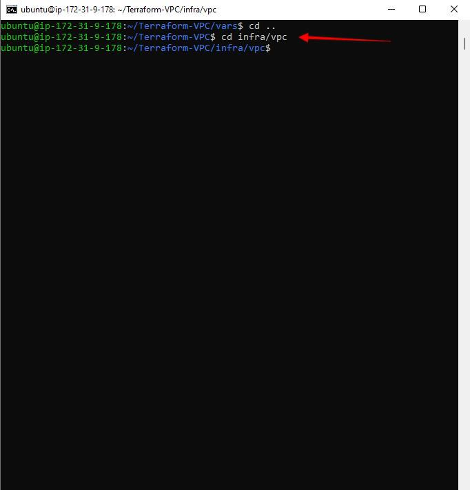

 This command is used to change into the directory where your Terraform files for creating the VPC are located. In this case, you're moving into the infra/vpc directory.

&#x2022;Firstly initialize Terraform
<code>terraform init</code>

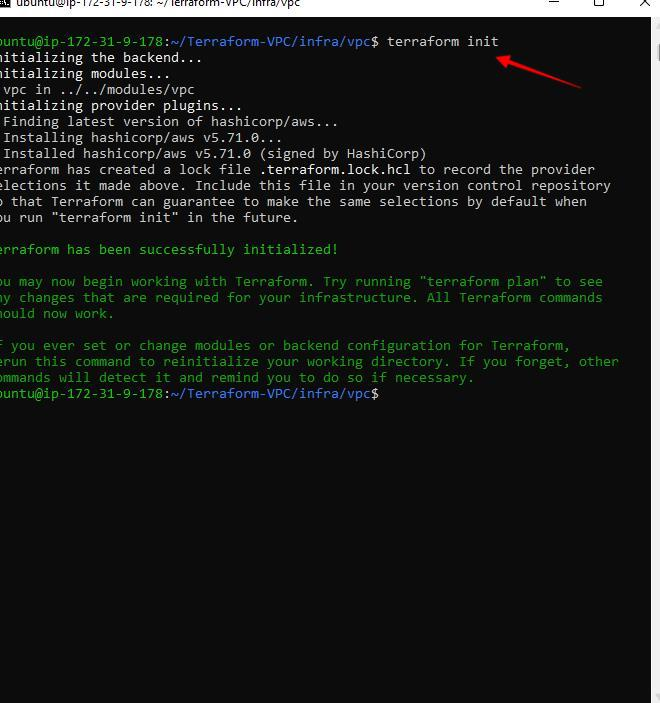

This step is necessary to set up Terraform for the project. It will download any plugins (like AWS) Terraform needs and prepare your project. You only need to do this once when you start working with Terraform in a new directory.

&#x2022;Execute the plan
<code>terraform plan -var-file=../../vars/dev/vpc.tfvars</code>

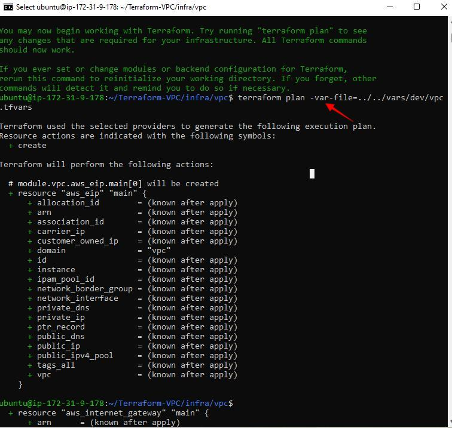

### Step 3: Create VPC With Terraform Apply
&#x2022;create the VPC and related resources using terraform apply.

<code>terraform apply -var-file=../../vars/dev/vpc.tfvars</code>

This is where I tell Terraform to actually create the resources on AWS. It will use the values from the vpc.tfvars file and make the necessary changes. You’ll see a summary of the changes before proceeding, and you have to confirm (by typing yes) to allow Terraform to create the VPC, subnets, internet gateways, etc.

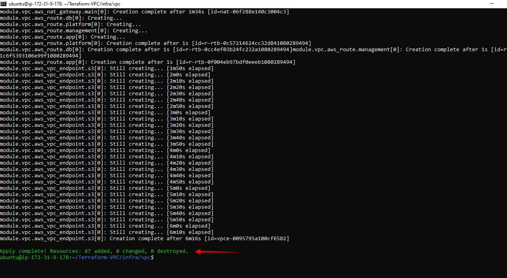

### Step 4: Validate VPC
Head over to the AWS Console the check the Resource Map of the VPC.

Click on the created VPC and scroll down to view the Resource Map.

You should see 15 subnets , 6 route tables, internet gateway and NAT gateway as shown below.

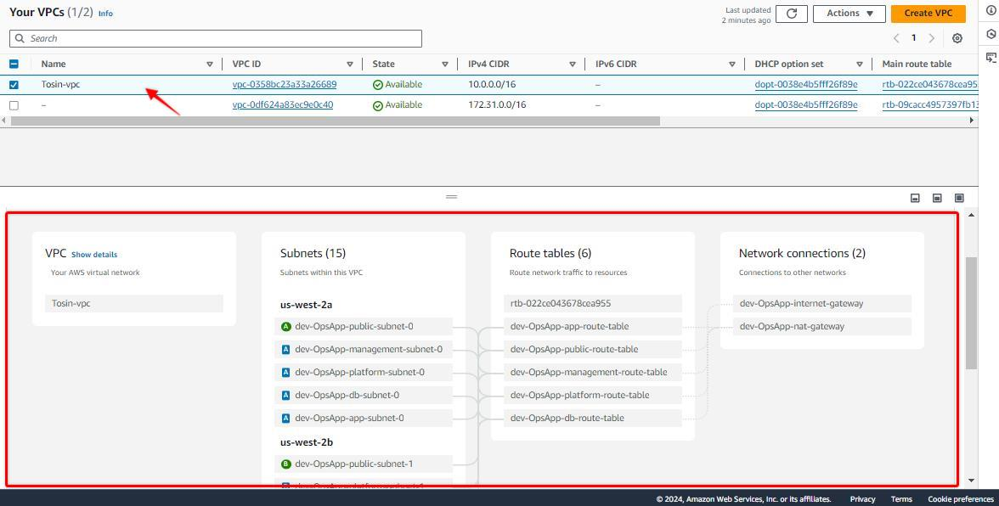

### Step 5: Cleanup the Resources
clean up the resources created by Terraform, execute the following command
<code>terraform destroy  -var-file=../../vars/dev/vpc.tfvars<code>

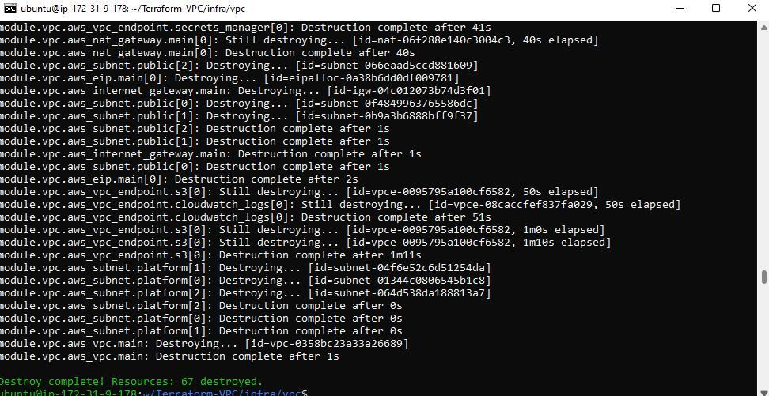