<h1>Dockerfile: Building Your First Image</h1>
<h3>Step 1 Provision an instance</h3>
&#x2022;Spin up an Ubuntu 24.04 t2.micro this is where I would  be doing the project in.

I then SSH into the instance

<h3>Step 2 - Install and start docker</h3>
For Ubuntu:

&#x2022;Update your package index:

<code>sudo apt update</code>
&#x2022;Install Docker:

<code>sudo apt install docker.io -y</code>

&#x2022;Start Docker:

<code>sudo systemctl start docker</code>
<code>sudo systemctl enable docker</code>

Check the Status of Docker

<code>sudo systemctl status docker</code>

ctrl + c to exit the running docker

<h3>Steps 3. Clone the Docker Project</h3>
Once Docker is installed and set up, clone the project repository.

Install Git (if not installed):

<code>sudo apt install git -y </code>

&#x2022;Clone the project repository:

git clone https://github.com/TobiOlajumoke/docker-flask
<code>cd docker-flask</code>

&#x2022;The docker file
<code>cat dockerfile</code>

Let’s break down the Dockerfile step by step:

1. <b>ARG PYTHON_VERSION=3.11.6</b> 
&#x2022;The Explanation: This defines a build-time variable (ARG) that specifies the version of Python to use. Here, it’s set to Python 3.11.6. 
&#x2022;The Why it's useful: By using an argument, you can easily change the Python version later without altering multiple lines in your Dockerfile. It also makes the Dockerfile more flexible. 
2. <b>FROM python:${PYTHON_VERSION}-slim as base</b> 
&#x2022;The Explanation: This tells Docker to use the official Python image (specifically, a slim version of it) as the base image. The slim variant of the Python image is a lightweight version that contains only the essentials for Python. 
&#x2022;The Why it's useful: Slim images are smaller and faster to download. This improves efficiency in building and running containers. 
3. <b>ENV PYTHONDONTWRITEBYTECODE=1</b> 
&#x2022;The Explanation: This environment variable prevents Python from writing .pyc files (compiled bytecode files). 
&#x2022;The Why it's useful: By avoiding the creation of bytecode files, you reduce unnecessary writes to the filesystem, which can be especially helpful in container environments where efficiency is key. 
4.<b> ENV PYTHONUNBUFFERED=1</b> 
&#x2022;The Explanation: This environment variable ensures that Python output is displayed directly to the terminal without buffering. 
&#x2022;The Why it's useful: In a container environment, you often want logs and outputs to be available immediately for monitoring purposes, so unbuffered output is preferred. 
5. <b>WORKDIR /app</b> 
&#x2022;The Explanation: This sets the working directory inside the container to /app. All subsequent commands in the Dockerfile will run from this directory. 
&#x2022;The Why it's useful: This isolates the app's code and dependencies inside a specific folder, making it easier to organize. 
6. <b>ARG UID=10001</b> 
&#x2022;The Explanation: This defines a build-time variable to specify the user ID for the application user (appuser), set to 10001 by default. 
&#x2022;The Why it's useful: By specifying a user ID, you improve security by running the application under a non-root user, which minimizes the risk in case of a container breach. 
7. <b>RUN adduser ... appuser</b>
&#x2022;The Explanation: This creates a new user (appuser) with the specified user ID, but without a password, home directory, or shell access. 
&#x2022;TheWhy it's useful: Running processes inside the container as a non-root user (appuser) is a best practice for security reasons, as it limits the damage that could be done by a malicious user. 
8. <b>COPY requirements.txt .</b> 
&#x2022;TheExplanation: This copies the requirements.txt file (which lists Python dependencies) from your local machine into the container’s /app directory. 
&#x2022;TheWhy it's useful: This file is required to install the necessary dependencies for the Python application.
9. <b>RUN python -m pip install -r requirements.txt</b> 
&#x2022;TheExplanation: This command installs all the dependencies listed in requirements.txt using Python’s package manager (pip). 
&#x2022;TheWhy it's useful: This ensures that all required Python libraries are installed inside the container, making the app self-contained. 
10. <b>USER appuser</b> 
&#x2022;TheExplanation: This switches the container's user to appuser (the non-root user we created earlier). 
&#x2022;TheWhy it's useful: Running the app as a non-root user enhances security by limiting the scope of what can be accessed within the container. 
11.<b> COPY . .</b> 
&#x2022;TheExplanation: This copies all the files from the current directory on your local machine into the /app directory inside the container. 
&#x2022;TheWhy it's useful: This is how the rest of your application code gets into the container. 
12. <b>EXPOSE 8000</b> 
&#x2022;TheExplanation: This informs Docker (and anyone using the image) that the container will listen for network requests on port 8000. 
&#x2022;TheWhy it's useful: This is necessary to expose the correct port to the outside world when running the container. 
13. <b>CMD ["gunicorn", "--bind", "0.0.0.0:8000", "hello:app"]</b> 
&#x2022;TheExplanation: This is the command that runs when the container starts. It launches your Python web application using Gunicorn, which is a WSGI server for Python web apps. 
&#x2022;The--bind 0.0.0.0:8000: Tells Gunicorn to bind the app to all network interfaces on port 8000, making it accessible. 
&#x2022;Thehello:app: This specifies the Python module (hello) and the WSGI application instance (app) to run. It assumes your Python application file is named hello.py and it contains a variable app that represents your Flask application. 

<h3>Step 4. Run the Docker Application</h3>
Build the Docker Image:

<code>docker build -t flask-application:1.0.0 .</code>

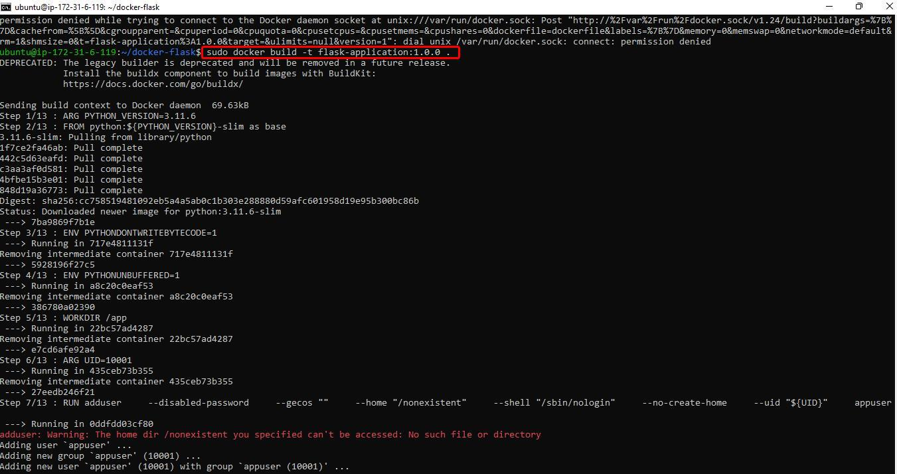

Check if the image built
<code>sudo docker images</code>

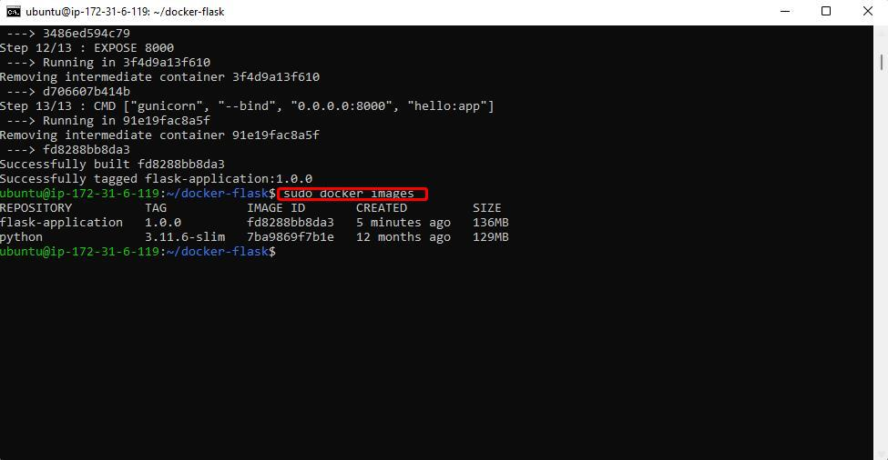

Run the Docker Container:

<code>sudo docker run -d -p 8000:8000 flask-application:1.0.0</code>

Check if the container is running if it is PROCEED to 3

<code>sudo docker ps</code>

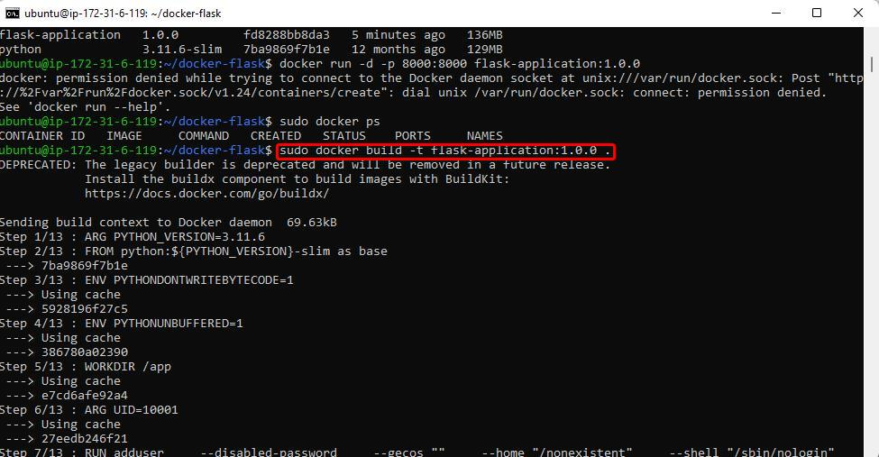

#### if the container isn't running check the list of all containers
<code>sudo docker ps -a</code>

To troubleshoot or find out why the container "exited" and isn't running you'll check the container logs by running this command

<code>sudo docker logs <container_id_or_name></code>

Test in Browser Now, go to your browser and access your EC2 public IP to check if the app is running properly:
<code>http://<your-ec2-public-ip>:8000<sudo>

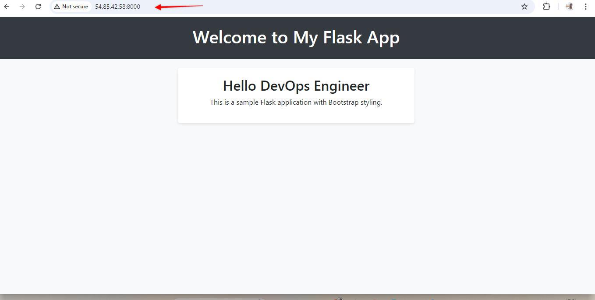

Run the Docker Container:
<code>sudo docker run -d -p 8000:8000 flask-application:1.0.0</code>

Check if the container is running if it is PROCEED to 3

<code>sudo docker ps</code>

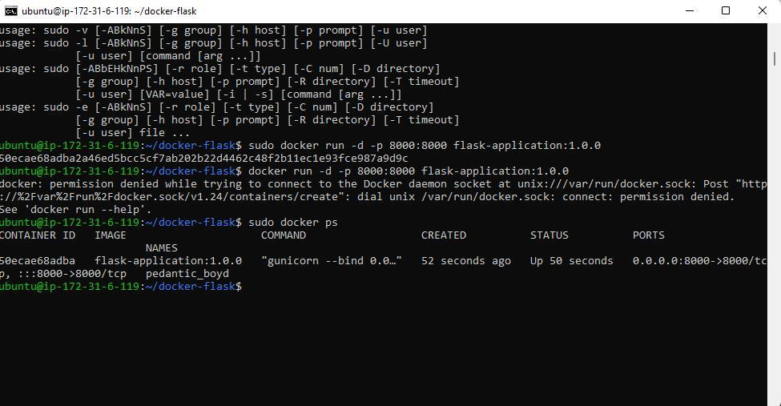

<code>sudo docker ps -a</code>
To troubleshoot or find out why the container "exited" and isn't running you'll check the container logs by running this command

<code>sudo docker logs <container_id_or_name><code>

Test in Browser Now, go to your browser and access your EC2 public IP to check if the app is running properly:
<code>http://<your-ec2-public-ip>:8000</code>

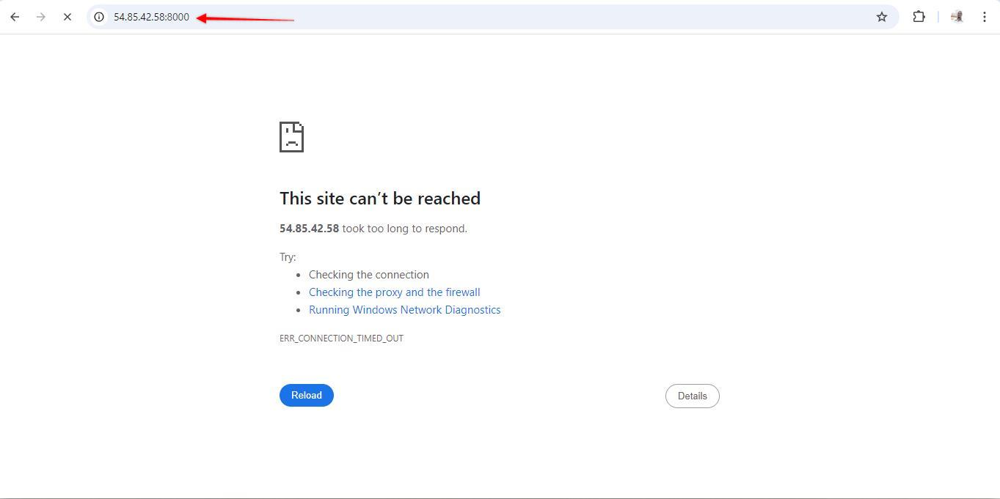

The webpage will not work, WHY?
we have not added the port 8000 to our security group of our instance so do that and try accessing the EC2 public IP

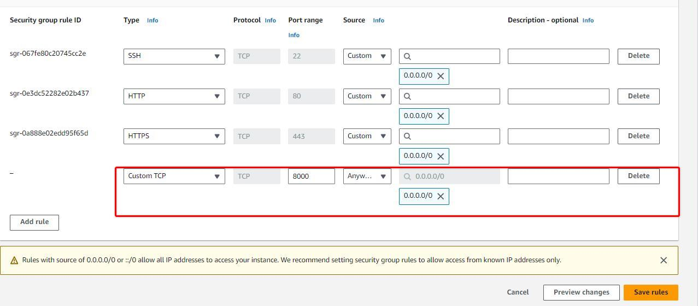

#### Let's push the image to docker hub
<b>Pushing Docker Images to Docker Hub</b>
After successfully building and running your Docker image, you may want to share it with others or deploy it to different environments. Docker Hub is a cloud-based registry service that allows you to store and distribute Docker images.

<b>Step 1: Create a Docker Hub Account</b>
Go to Docker Hub.
Sign up for a free account if you don’t have one already.

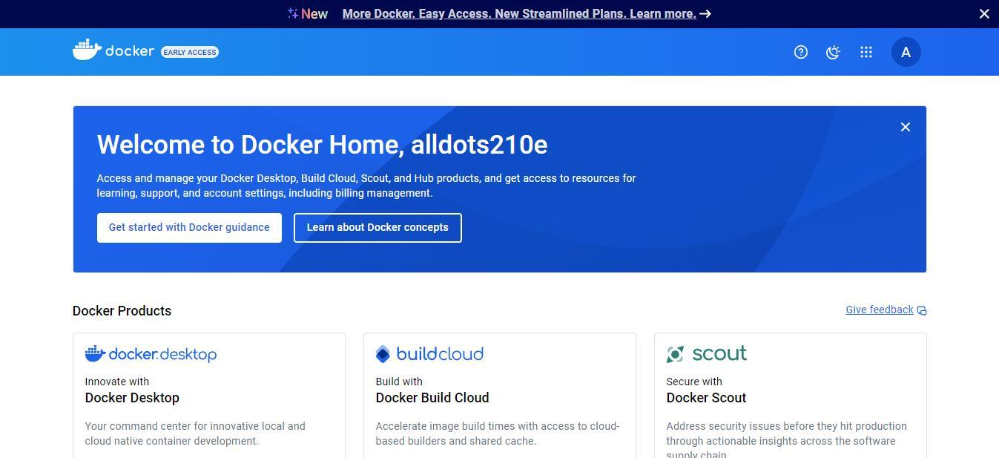

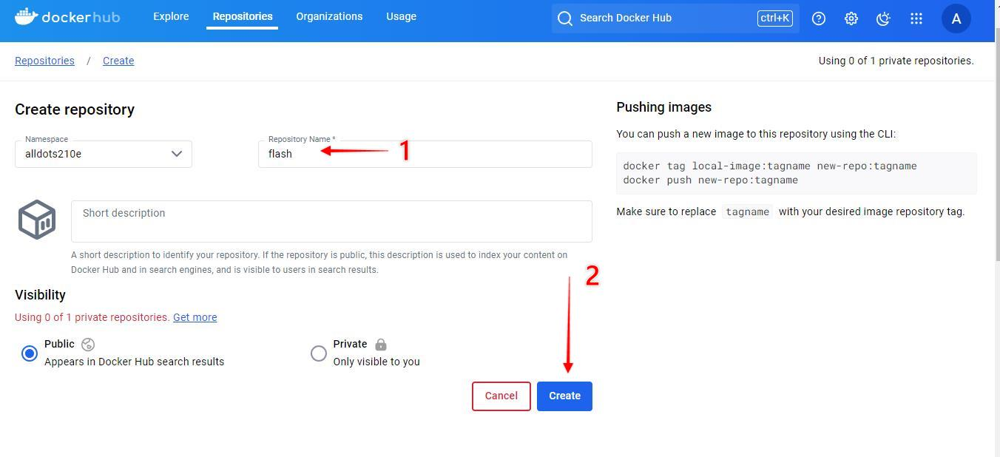

<b>Step 2: Log In to Docker Hub from Your Terminal</b>
Use the Docker CLI to log in to your Docker Hub account:

<code>sudo docker login</code>

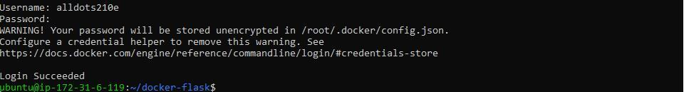

You will be prompted to enter your Docker Hub username and password.

<b>Step 3: Tag Your Image</b>
Before pushing the image, you need to tag it with your Docker Hub username and a repository name. The tagging format is:

<code><your-dockerhub-username>/<repository-name>:<tag></code>
For example:

<code>sudo docker tag flask-application:1.0.0 yourusername/flask-application:1.0.0</code>

<b>Why Do We Tag Docker Images?</b>

Version Control: Tagging helps you manage different versions of your images. By using tags, you can easily identify specific versions of your application, which is crucial for testing and deployment.
&#x2022;Clarity: Tags provide clarity about what an image contains. For example, a tag can indicate whether the image is a stable release, a beta version, or a development build.
&#x2022;Rollback: If an issue arises with a new version, you can quickly revert to a previous, stable version using its tag.

<h4>Step 4: Push the Image to Docker Hub</h4>
Once your image is tagged, you can push it to Docker Hub using the following command:

<code>sudo docker push yourusername/flask-application:1.0.0</code>

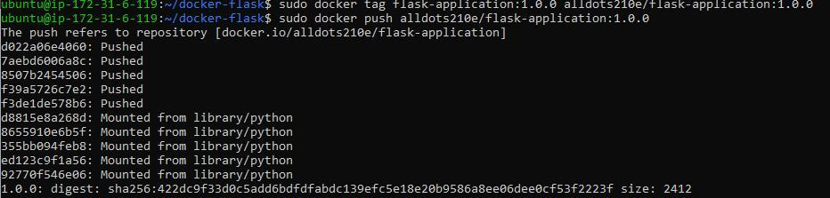

### Step 5: Verify the Push

Why Push to Docker Hub?
&#x2022;Collaboration: Team members can easily access shared images without having to build them from scratch.
&#x2022;Backup: Storing images on Docker Hub acts as a backup, ensuring that you can recover or roll back to previous versions if needed.
&#x2022;Deployment: You can pull images directly from Docker Hub in different environments, simplifying the deployment process.